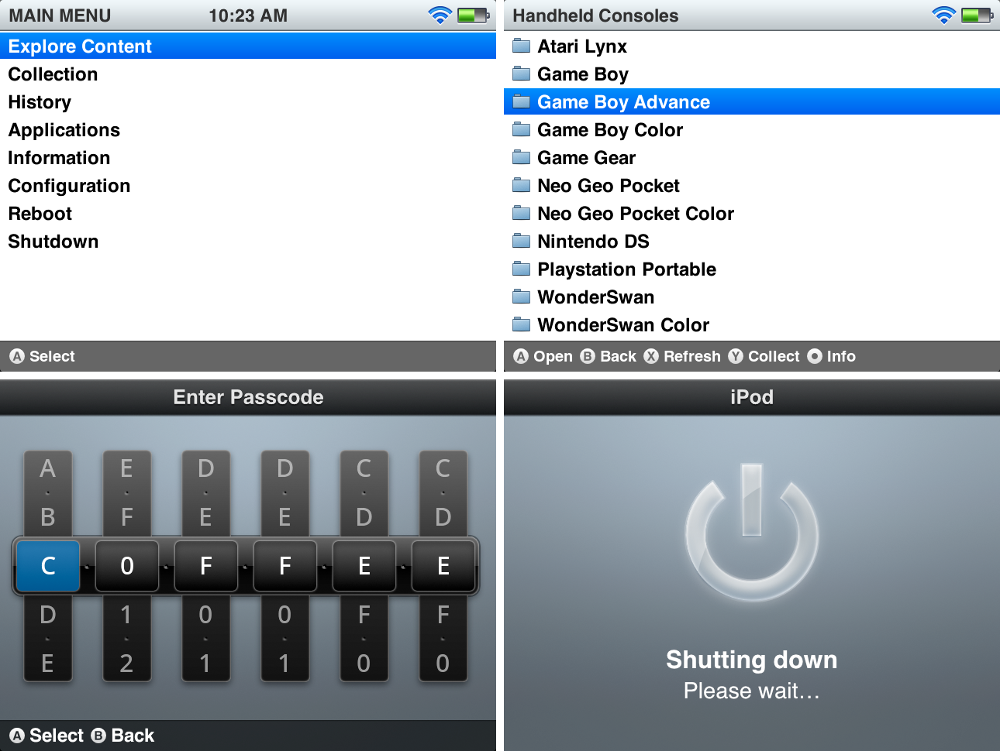

# iPod Classic Theme for Mustard OS
A theme inspired by the iPod Classic era of Apple products. Made by Emma Alyx Wunder: 
[https://emmalyx.dev](https://emmalyx.dev)

## muOS Pixie Edition

### Requirements
* Pixie 2502.0 or greater
* 640x480 or 720x480 resolution

### Installation
1. Download the [latest release](../../releases/latest)
2. Copy `iPod.muxthm` to either of the following locations:
   * SD1/Archive
   * SD2/Archive
3. Install the theme via Archive Manager

## Roadmap
These considerations for improvement by the muOS community:
* HDMI support (@teeawgo)
* Dark Theme (@eider)
* iPod click wheel sounds (@eider)
* 'muOS' headers on shutdown/reboot (@Jamesinorbit)
*  RGCubeXX support (?)